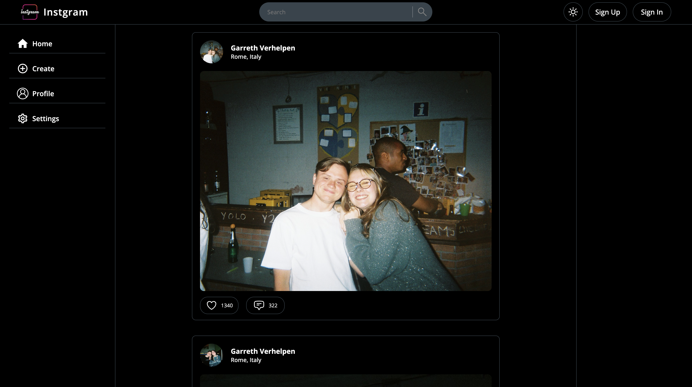
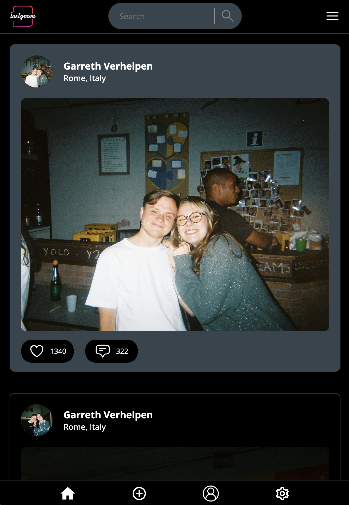

# Camagru
This project is a warmup for web. You will need to realize, a small, instagram-like website allowing its users to create and share photomontage. You will, from scratch, implement basic functionnalities used by any website with a userbase

## Frontend : Vanilla html/css/js (*responsive*)
Here's some picture of the frontend of my Camagru. Everything is for sure responsive!

### Home section

### Profile section

## Backend

### References

- [Image superposition](https://openclassrooms.com/forum/sujet/bd-transparence-png-et-superposition-d-images)
- [Send emails](https://www.justinsilver.com/technology/osx/send-emails-mac-os-x-postfix-gmail-relay/)
- [FileField](https://wtforms.readthedocs.io/en/2.3.x/fields/)
- [Cheat sheet CSS](https://css-tricks.com/snippets/css/a-guide-to-flexbox/#flexbox-background)
- [State in JS](https://www.codeinwp.com/snippets/jquery-document-ready-in-vanilla-javascript/#gref)
- [SQL Injection tutorial](http://www.tizag.com/mysqlTutorial/mysql-php-sql-injection.php)
